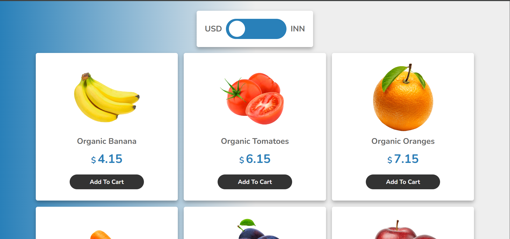
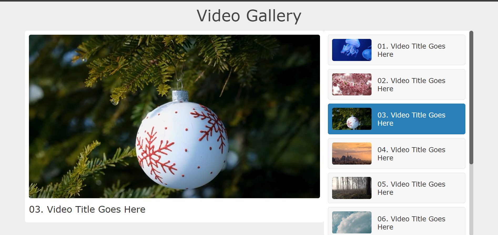

# HTML, CSS, and JavaScript Projects

This repository contains multiple projects built using HTML, CSS, and JavaScript. Each project showcases different functionalities and designs, from e-commerce platforms to currency converters and video galleries.

## Project Structure

## Starbucks Landing Page
A visually appealing landing page for Starbucks with product details and clean design elements.

## Computer Landing Page
A minimalist landing page for promoting computer products with a sleek and modern design.

## Online Shopping
An online shopping platform featuring a toggle for currency conversion (USD to INR) and a dynamic cart system.

## USD to INR Convertor
A simple, dynamic currency conversion feature allowing users to toggle between USD and INR when viewing product prices.

## Video Playlist Gallery
A user-friendly video gallery where users can select and play videos from a list.

